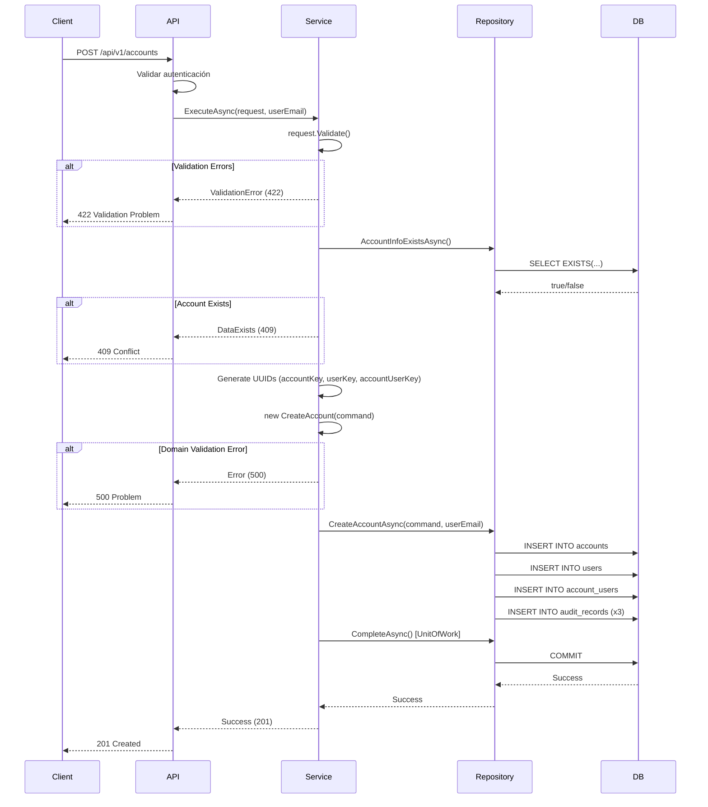
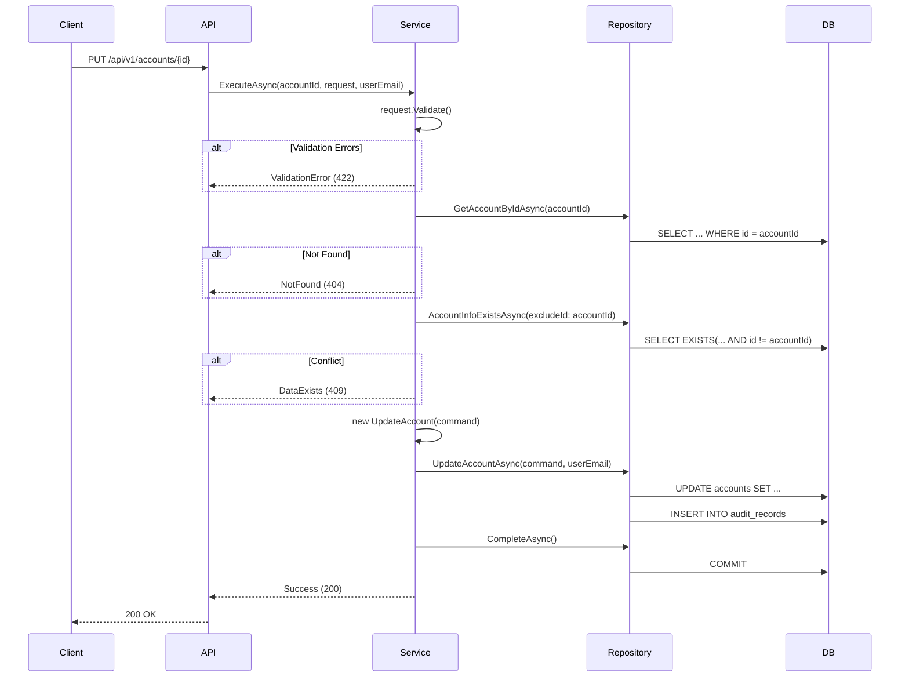
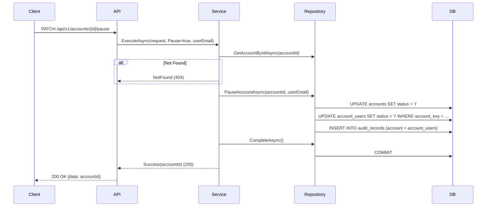

# Documentación Completa - Feature de Accounts

## Índice

1. [Visión General](#visión-general)
2. [Arquitectura](#arquitectura)
3. [Modelo de Dominio](#modelo-de-dominio)
4. [Casos de Uso](#casos-de-uso)
5. [API Endpoints](#api-endpoints)
6. [Modelo de Datos](#modelo-de-datos)
7. [Validaciones](#validaciones)
8. [Auditoría](#auditoría)
9. [Flujos de Trabajo](#flujos-de-trabajo)

---

## Visión General

La **Feature de Accounts** es el módulo principal del sistema NUBULUS AccountsAppsPortal que gestiona las cuentas (organizaciones/empresas) dentro de la plataforma. Cada cuenta representa una organización que puede tener múltiples usuarios asociados.

### Características Principales

- ✅ Creación de cuentas con usuario creador automático
- ✅ Consulta de cuentas con paginación y búsqueda
- ✅ Actualización de información de cuentas
- ✅ Pausa y reanudación de cuentas (soft delete)
- ✅ Validación robusta en múltiples capas
- ✅ Auditoría completa de todas las operaciones
- ✅ Autenticación requerida en todos los endpoints

### Tecnologías

- **Framework**: ASP.NET Core 8 con Minimal APIs
- **Base de Datos**: PostgreSQL con Entity Framework Core
- **Arquitectura**: Clean Architecture (Domain, Application, Infrastructure)
- **Autenticación**: Microsoft Identity (Azure AD)

---

## Arquitectura

La feature sigue el patrón de **Clean Architecture** con las siguientes capas:

```
┌─────────────────────────────────────────────────────────────┐
│                    API Layer (Presentación)                  │
│  ┌─────────────────────────────────────────────────────┐    │
│  │ Features/Account/                                    │    │
│  │   ├── CreateAccount/                                 │    │
│  │   │   ├── CreateAccountEndPoint.cs                   │    │
│  │   │   ├── CreateAccountService.cs                    │    │
│  │   │   └── CreateAccountRequest.cs                    │    │
│  │   ├── GetAccounts/                                   │    │
│  │   ├── GetAccount/                                    │    │
│  │   ├── UpdateAccount/                                 │    │
│  │   ├── PauseResumeAccount/                            │    │
│  │   ├── Common/                                        │    │
│  │   │   ├── AccountDto.cs                              │    │
│  │   │   ├── AccountInfoDto.cs                          │    │
│  │   │   └── AccountMappers.cs                          │    │
│  │   └── DI.cs                                          │    │
│  └─────────────────────────────────────────────────────┘    │
└─────────────────────────────────────────────────────────────┘
                            ▼
┌─────────────────────────────────────────────────────────────┐
│                    Domain Layer (Negocio)                    │
│  ┌─────────────────────────────────────────────────────┐    │
│  │ Entities/Account/                                    │    │
│  │   ├── AccountEntity.cs                               │    │
│  │   ├── CreateAccount.cs                               │    │
│  │   └── UpdateAccount.cs                               │    │
│  │                                                       │    │
│  │ ValueObjects/                                        │    │
│  │   ├── AccountId.cs                                   │    │
│  │   ├── AccountKey.cs                                  │    │
│  │   ├── EmailAddress.cs                                │    │
│  │   └── Status.cs                                      │    │
│  │                                                       │    │
│  │ Abstractions/                                        │    │
│  │   └── IAccountsRepository.cs                         │    │
│  └─────────────────────────────────────────────────────┘    │
└─────────────────────────────────────────────────────────────┘
                            ▼
┌─────────────────────────────────────────────────────────────┐
│              Infrastructure Layer (Persistencia)             │
│  ┌─────────────────────────────────────────────────────┐    │
│  │ pgsql/                                               │    │
│  │   ├── Models/                                        │    │
│  │   │   ├── Account.cs                                 │    │
│  │   │   ├── User.cs                                    │    │
│  │   │   ├── AccountUser.cs                             │    │
│  │   │   └── AuditRecord.cs                             │    │
│  │   │                                                   │    │
│  │   ├── Repositories/                                  │    │
│  │   │   └── AccountRepository.cs                       │    │
│  │   │                                                   │    │
│  │   ├── PostgreDBContext.cs                            │    │
│  │   └── UnitOfWork.cs                                  │    │
│  └─────────────────────────────────────────────────────┘    │
└─────────────────────────────────────────────────────────────┘
```

### Flujo de Datos

```
Cliente HTTP Request
    ↓
EndPoint (Minimal API)
    ↓
Service (Validación + Lógica)
    ↓
Repository (IAccountsRepository)
    ↓
PostgreDBContext (EF Core)
    ↓
PostgreSQL Database
```

---

## Modelo de Dominio

### 1. AccountEntity

Representa una cuenta (organización) en el sistema.

**Ubicación**: `domain/Entities/Account/AccountEntity.cs`

```csharp
public class AccountEntity
{
    public AccountId AccountId { get; set; }         // ID numérico único
    public AccountKey AccountKey { get; set; }       // Clave UUID única
    public string Name { get; set; }                 // Nombre de la cuenta
    public string FullName { get; set; }             // Nombre completo del creador
    public EmailAddress Email { get; set; }          // Email de la cuenta
    public string Phone { get; set; }                // Teléfono
    public string Address { get; set; }              // Dirección
    public string NumberId { get; set; }             // Número de identificación
    public Status Status { get; set; }               // Estado (A=Activo, I=Inactivo)
}
```

### 2. Value Objects

#### AccountId

- **Propósito**: Identificador numérico único
- **Validación**: Debe ser > 0
- **Tipo**: `int`

```csharp
public class AccountId
{
    public int Value { get; private set; }

    public AccountId(int value)
    {
        if (value <= 0)
            throw new ArgumentException("Account ID must be a positive integer.");
        Value = value;
    }
}
```

#### AccountKey

- **Propósito**: Clave única UUID
- **Validación**: No nulo/vacío, máximo 36 caracteres
- **Tipo**: `string` (UUID)

```csharp
public class AccountKey
{
    public string Value { get; private set; }

    public AccountKey(string value)
    {
        if (string.IsNullOrWhiteSpace(value))
            throw new ArgumentException("Account key cannot be null or empty.");
        if (value.Length > 36)
            throw new ArgumentException("Account key must not exceed 36 characters.");
        Value = value;
    }
}
```

#### EmailAddress

- **Propósito**: Dirección de correo electrónico
- **Validación**: Formato válido de email
- **Ubicación**: `domain/ValueObjects/EmailAddress.cs`

#### Status

- **Propósito**: Estado de la cuenta
- **Valores**: `Active ("A")`, `Inactive ("I")`
- **Patrón**: Type-safe enum

```csharp
public class Status
{
    public string Value { get; private set; }

    public static Status Active => new Status("A");
    public static Status Inactive => new Status("I");

    public static Status Parse(string status)
    {
        return status switch
        {
            "A" => Active,
            "I" => Inactive,
            _ => throw new ArgumentException($"Invalid account status: {status}")
        };
    }
}
```

### 3. Comandos de Dominio

#### CreateAccount

Comando para crear una nueva cuenta con usuario asociado.

**Ubicación**: `domain/Entities/Account/CreateAccount.cs`

```csharp
public class CreateAccount
{
    public AccountKey AccountKey { get; private set; }
    public string UserKey { get; private set; }
    public string AccountUserKey { get; private set; }
    public string Name { get; private set; }
    public string FullName { get; private set; }
    public EmailAddress Email { get; private set; }
    public string Phone { get; private set; }
    public string Address { get; private set; }
    public string NumberId { get; private set; }

    public CreateAccount(/* parámetros */)
    {
        // Asignación de propiedades
        CreateAccountValidator validator = new CreateAccountValidator(this);
    }
}
```

**Validaciones automáticas** (ejecutadas en el constructor):

- ✅ AccountKey: requerido, máximo 36 caracteres
- ✅ UserKey: requerido, máximo 36 caracteres
- ✅ AccountUserKey: requerido, máximo 36 caracteres
- ✅ Name: entre 2 y 100 caracteres
- ✅ FullName: opcional, máximo 100 caracteres
- ✅ Email: entre 5 y 100 caracteres, formato válido
- ✅ Phone: entre 10 y 15 caracteres, formato `^\+?[0-9]{10,15}$`
- ✅ Address: entre 5 y 200 caracteres
- ✅ NumberId: entre 5 y 50 caracteres

#### UpdateAccount

Comando para actualizar una cuenta existente.

**Ubicación**: `domain/Entities/Account/UpdateAccount.cs`

```csharp
public class UpdateAccount
{
    public AccountId AccountId { get; private set; }
    public string Name { get; private set; }
    public EmailAddress Email { get; private set; }
    public string Phone { get; private set; }
    public string Address { get; private set; }
    public string NumberId { get; private set; }

    public UpdateAccount(/* parámetros */)
    {
        // Asignación de propiedades
        UpdateAccountValidator validator = new UpdateAccountValidator(this);
    }
}
```

**Validaciones automáticas**:

- ✅ AccountId: debe ser > 0
- ✅ Name: entre 2 y 100 caracteres
- ✅ Email: entre 5 y 100 caracteres, formato válido
- ✅ Phone: entre 10 y 15 caracteres, formato válido
- ✅ Address: opcional, máximo 200 caracteres
- ✅ NumberId: opcional, máximo 50 caracteres

---

## Casos de Uso

### 1. CreateAccount (Crear Cuenta)

**Endpoint**: `POST /api/v1/accounts`  
**Autenticación**: ✅ Requerida

#### Request

```csharp
public class CreateAccountRequest
{
    public string Name { get; init; }         // Nombre de la cuenta
    public string FullName { get; init; }     // Nombre completo del creador
    public string Email { get; init; }        // Email
    public string Phone { get; init; }        // Teléfono
    public string Address { get; init; }      // Dirección
    public string NumberId { get; init; }     // Número de identificación
}
```

**Ejemplo de Request**:

```json
{
  "name": "ACME Corporation",
  "fullName": "John Doe",
  "email": "contact@acme.com",
  "phone": "+34612345678",
  "address": "Calle Mayor 123, Madrid",
  "numberId": "B12345678"
}
```

#### Flujo del Servicio

```csharp
public async Task<IGenericResponse<int?>> ExecuteAsync(
    CreateAccountRequest request,
    string userContextEmail,
    CancellationToken cancellationToken)
{
    // 1. Validar request
    if (request.Validate().Count > 0)
        return CreateAccountResponse.ValidationError(request.Validate());

    // 2. Verificar si ya existe una cuenta con los mismos datos
    var existingAccount = await _unitOfWork.Accounts.AccountInfoExistsAsync(
        request.Name, request.Email, request.Phone, request.NumberId,
        cancellationToken);

    if (existingAccount)
        return CreateAccountResponse.DataExists("Account already exists.");

    // 3. Generar claves UUID
    var accountKey = Guid.NewGuid().ToString();
    var userKey = Guid.NewGuid().ToString();
    var accountUserKey = Guid.NewGuid().ToString();

    // 4. Ejecutar comando de dominio
    var command = new CreateAccount(
        new AccountKey(accountKey),
        userKey,
        accountUserKey,
        request.Name,
        request.FullName,
        new EmailAddress(request.Email),
        request.Phone,
        request.Address,
        request.NumberId
    );

    // 5. Persistir en base de datos
    await _unitOfWork.Accounts.CreateAccountAsync(command,
        new EmailAddress(userContextEmail), cancellationToken);
    await _unitOfWork.CompleteAsync(cancellationToken);

    return CreateAccountResponse.Success();
}
```

#### Respuestas Posibles

| Código HTTP            | ResultType | Descripción                                            |
| ---------------------- | ---------- | ------------------------------------------------------ |
| 201 Created            | Ok         | Cuenta creada exitosamente                             |
| 409 Conflict           | Conflict   | Ya existe una cuenta con Name, Email, Phone o NumberId |
| 422 Validation Problem | Problems   | Errores de validación en los campos                    |
| 500 Problem            | Error      | Error inesperado del servidor                          |

#### Efectos Secundarios

Al crear una cuenta, se crean automáticamente:

1. **Account**: Registro de la cuenta
2. **User**: Usuario creador
3. **AccountUser**: Relación cuenta-usuario con flag `Creator = "Y"`
4. **AuditRecords**: 3 registros de auditoría (uno por cada entidad)

---

### 2. GetAccounts (Listar Cuentas)

**Endpoint**: `GET /api/v1/accounts`  
**Autenticación**: ✅ Requerida

#### Request

```csharp
public class GetAccountsRequest
{
    public string? SearchTerm { get; set; }      // Término de búsqueda (opcional)
    public int? PageNumber { get; set; }         // Número de página (default: 1)
    public int? PageSize { get; set; }           // Tamaño de página (default: 10)
}
```

**Parámetros de Query**:

- `searchTerm`: Busca en Name, Email, Phone, NumberId y FullName del creador
- `pageNumber`: Número de página (1-based)
- `pageSize`: Cantidad de resultados por página

**Ejemplo de Request**:

```
GET /api/v1/accounts?searchTerm=ACME&pageNumber=1&pageSize=20
```

#### Response

```csharp
public record PaginatedResponse<AccountDto>
{
    public int TotalCount { get; init; }      // Total de registros
    public int PageNumber { get; init; }      // Página actual
    public int PageSize { get; init; }        // Tamaño de página
    public List<AccountDto> Items { get; init; }  // Resultados
}

public class AccountDto
{
    public int AccountId { get; set; }
    public string Name { get; set; }
    public string FullName { get; set; }      // Nombre del creador
    public string Email { get; set; }
    public string Phone { get; set; }
    public string NumberId { get; set; }
    public string Status { get; set; }        // "A" o "I"
}
```

**Ejemplo de Response**:

```json
{
  "totalCount": 150,
  "pageNumber": 1,
  "pageSize": 20,
  "items": [
    {
      "accountId": 1,
      "name": "ACME Corporation",
      "fullName": "John Doe",
      "email": "contact@acme.com",
      "phone": "+34612345678",
      "numberid": "B12345678",
      "status": "A"
    }
  ]
}
```

#### Lógica de Búsqueda

El `SearchTerm` busca coincidencias (case-insensitive) en:

- Account.Name
- Account.Email
- Account.Phone
- Account.NumberId
- User.Name (nombre completo del creador)

```sql
-- Query generado por EF Core
SELECT a.*, u.Name as FullName
FROM accounts a
JOIN account_users au ON a.key = au.account_key AND au.creator = 'Y'
JOIN users u ON au.user_key = u.key
WHERE
    UPPER(a.name) LIKE '%ACME%' OR
    UPPER(a.email) LIKE '%ACME%' OR
    UPPER(a.phone) LIKE '%ACME%' OR
    UPPER(a.number_id) LIKE '%ACME%' OR
    UPPER(u.name) LIKE '%ACME%'
ORDER BY a.id
OFFSET 0 ROWS FETCH NEXT 20 ROWS ONLY;
```

---

### 3. GetAccount (Obtener Cuenta por ID)

**Endpoint**: `GET /api/v1/accounts/{accountId}`  
**Autenticación**: ✅ Requerida

#### Request

```csharp
public class GetAccountRequest
{
    public int AccountId { get; set; }   // ID de la cuenta (route parameter)
}
```

**Ejemplo de Request**:

```
GET /api/v1/accounts/123
```

#### Response

```csharp
public class AccountInfoDto
{
    public int AccountId { get; set; }
    public string Name { get; set; }
    public string FullName { get; set; }
    public string Email { get; set; }
    public string Phone { get; set; }
    public string NumberId { get; set; }
    public string Address { get; set; }      // Incluye dirección completa
    public string Status { get; set; }
}
```

**Ejemplo de Response**:

```json
{
  "accountId": 123,
  "name": "ACME Corporation",
  "fullName": "John Doe",
  "email": "contact@acme.com",
  "phone": "+34612345678",
  "numberId": "B12345678",
  "address": "Calle Mayor 123, Madrid",
  "status": "A"
}
```

#### Respuestas Posibles

| Código HTTP   | ResultType | Descripción        |
| ------------- | ---------- | ------------------ |
| 200 OK        | Ok         | Cuenta encontrada  |
| 404 Not Found | NotFound   | Cuenta no existe   |
| 500 Problem   | Error      | Error del servidor |

---

### 4. UpdateAccount (Actualizar Cuenta)

**Endpoint**: `PUT /api/v1/accounts/{accountId}`  
**Autenticación**: ✅ Requerida

#### Request

```csharp
public class UpdateAccountRequest
{
    public string Name { get; init; }
    public string Email { get; init; }
    public string Phone { get; init; }
    public string Address { get; init; }
    public string NumberId { get; init; }
}
```

**Ejemplo de Request**:

```
PUT /api/v1/accounts/123
```

```json
{
  "name": "ACME Corp Updated",
  "email": "newemail@acme.com",
  "phone": "+34612345679",
  "address": "Nueva Dirección 456",
  "numberId": "B12345678"
}
```

#### Flujo del Servicio

```csharp
public async Task<IGenericResponse<int?>> ExecuteAsync(
    int accountId,
    UpdateAccountRequest request,
    string currentUserEmail,
    CancellationToken cancellationToken)
{
    // 1. Validar request
    if (request.Validate().Count > 0)
        return UpdateAccountResponse.ValidationError(request.Validate());

    // 2. Verificar que la cuenta exista
    var account = await _unitOfWork.Accounts.GetAccountByIdAsync(
        new AccountId(accountId), cancellationToken);

    if (account == null)
        return UpdateAccountResponse.NotFound($"Account with ID {accountId} not found.");

    // 3. Verificar que no exista otra cuenta con los mismos datos
    //    (excluyendo la cuenta actual)
    var existingAccount = await _unitOfWork.Accounts.AccountInfoExistsAsync(
        request.Name, request.Email, request.Phone, request.NumberId,
        cancellationToken,
        account.AccountId);  // Excluir cuenta actual

    if (existingAccount)
        return UpdateAccountResponse.DataExists("Account with same data already exists.");

    // 4. Ejecutar comando de dominio
    var command = new UpdateAccount(
        account.AccountId,
        request.Name,
        new EmailAddress(request.Email),
        request.Phone,
        request.Address,
        request.NumberId
    );

    // 5. Persistir cambios
    await _unitOfWork.Accounts.UpdateAccountAsync(command,
        new EmailAddress(currentUserEmail), cancellationToken);
    await _unitOfWork.CompleteAsync(cancellationToken);

    return UpdateAccountResponse.Success();
}
```

#### Respuestas Posibles

| Código HTTP            | ResultType | Descripción                        |
| ---------------------- | ---------- | ---------------------------------- |
| 200 OK                 | Ok         | Cuenta actualizada                 |
| 404 Not Found          | NotFound   | Cuenta no existe                   |
| 409 Conflict           | Conflict   | Otra cuenta tiene los mismos datos |
| 422 Validation Problem | Problems   | Errores de validación              |
| 500 Problem            | Error      | Error del servidor                 |

---

### 5. PauseAccount / ResumeAccount (Pausar/Reanudar Cuenta)

**Endpoints**:

- `PATCH /api/v1/accounts/{accountId}/pause`
- `PATCH /api/v1/accounts/{accountId}/resume`

**Autenticación**: ✅ Requerida

#### Request

```csharp
public class PauseResumeAccountRequest
{
    public int AccountId { get; set; }   // Route parameter
}
```

**Ejemplo de Requests**:

```
PATCH /api/v1/accounts/123/pause
PATCH /api/v1/accounts/123/resume
```

#### Flujo del Servicio

```csharp
public async Task<IGenericResponse<int?>> ExecuteAsync(
    PauseResumeAccountRequest request,
    bool Pause,  // true = pausar, false = reanudar
    string currentUserEmail,
    CancellationToken cancellationToken)
{
    // 1. Verificar que la cuenta exista
    var account = await _unitOfWork.Accounts.GetAccountByIdAsync(
        new AccountId(request.AccountId), cancellationToken);

    if (account == null)
        return PauseResumeAccountResponse.NotFound("Account not found.");

    // 2. Ejecutar operación correspondiente
    if (Pause)
    {
        await _unitOfWork.Accounts.PauseAccountAsync(
            account.AccountId,
            new EmailAddress(currentUserEmail),
            cancellationToken);
    }
    else
    {
        await _unitOfWork.Accounts.ResumeAccountAsync(
            account.AccountId,
            new EmailAddress(currentUserEmail),
            cancellationToken);
    }

    await _unitOfWork.CompleteAsync(cancellationToken);

    return PauseResumeAccountResponse.Success(request.AccountId);
}
```

#### Efectos de Pausar

Cuando se pausa una cuenta:

1. **Account.Status** → `"I"` (Inactive)
2. **AccountUsers.Status** → `"I"` (todos los usuarios de la cuenta)
3. **AuditRecords**: Se crean registros de auditoría para cuenta y relaciones

#### Efectos de Reanudar

Cuando se reanuda una cuenta:

1. **Account.Status** → `"A"` (Active)
2. **AccountUsers.Status** → `"A"` (todos los usuarios de la cuenta)
3. **AuditRecords**: Se crean registros de auditoría para cuenta y relaciones

#### Respuestas Posibles

| Código HTTP   | ResultType | Descripción                          |
| ------------- | ---------- | ------------------------------------ |
| 200 OK        | Ok         | Operación exitosa, retorna AccountId |
| 404 Not Found | NotFound   | Cuenta no existe                     |
| 500 Problem   | Error      | Error del servidor                   |

---

## API Endpoints

### Resumen de Endpoints

| Método | Ruta                                  | Autenticación | Descripción               |
| ------ | ------------------------------------- | ------------- | ------------------------- |
| POST   | `/api/v1/accounts`                    | ✅            | Crear cuenta              |
| GET    | `/api/v1/accounts`                    | ✅            | Listar cuentas (paginado) |
| GET    | `/api/v1/accounts/{accountId}`        | ✅            | Obtener cuenta por ID     |
| PUT    | `/api/v1/accounts/{accountId}`        | ✅            | Actualizar cuenta         |
| PATCH  | `/api/v1/accounts/{accountId}/pause`  | ✅            | Pausar cuenta             |
| PATCH  | `/api/v1/accounts/{accountId}/resume` | ✅            | Reanudar cuenta           |

### Configuración de Endpoints

Todos los endpoints están configurados en sus respectivos archivos `*EndPoint.cs`:

```csharp
public static class CreateAccountEndPoint
{
    public static WebApplication MapCreateAccountEndPoint(this WebApplication app)
    {
        app.MapPost(CreateAccountRequest.Route, async (
            HttpContext context,
            [FromBody] CreateAccountRequest request,
            [FromServices] CreateAccountService service,
            CancellationToken cancellationToken) =>
        {
            // Obtener email del usuario autenticado
            var userEmail = context.User.Identities.FirstOrDefault()!.Name!;

            var response = await service.ExecuteAsync(
                request, userEmail, cancellationToken);

            // Pattern matching para resultados
            return response.ResultType switch
            {
                ResultType.Ok => Results.Created(),
                ResultType.Conflict => Results.Conflict(response.Message),
                ResultType.Problems => Results.ValidationProblem(response.ValidationErrors!),
                _ => Results.Problem(response.Message)
            };
        })
        .WithName("CreateAccount")
        .WithTags("Accounts")
        .RequireAuthorization();  // Requiere autenticación

        return app;
    }
}
```

### Headers Requeridos

Todos los endpoints requieren autenticación mediante Microsoft Identity:

```http
Authorization: Bearer {token}
Content-Type: application/json
```

---

## Modelo de Datos

### Esquema de Base de Datos (PostgreSQL)

#### Tabla: accounts

```sql
CREATE TABLE accounts (
    id          SERIAL PRIMARY KEY,
    key         VARCHAR(36) UNIQUE NOT NULL,  -- Primary Key alternativa (UUID)
    name        VARCHAR(100) NOT NULL,
    email       VARCHAR(100) NOT NULL,
    phone       VARCHAR(15) NOT NULL,
    address     VARCHAR(200) NOT NULL,
    number_id   VARCHAR(50) NOT NULL,
    status      VARCHAR(1) NOT NULL DEFAULT 'A'  -- 'A' = Active, 'I' = Inactive
);

CREATE INDEX idx_accounts_id ON accounts(id);
CREATE UNIQUE INDEX idx_accounts_key ON accounts(key);
```

#### Tabla: users

```sql
CREATE TABLE users (
    id      SERIAL PRIMARY KEY,
    key     VARCHAR(36) UNIQUE NOT NULL,
    name    VARCHAR(100) NOT NULL,
    email   VARCHAR(100) NOT NULL
);
```

#### Tabla: account_users (relación muchos a muchos)

```sql
CREATE TABLE account_users (
    id              SERIAL PRIMARY KEY,
    key             VARCHAR(36) UNIQUE NOT NULL,
    account_key     VARCHAR(36) NOT NULL,
    user_key        VARCHAR(36) NOT NULL,
    creator         VARCHAR(1) NOT NULL DEFAULT 'N',  -- 'Y' = creador, 'N' = miembro
    status          VARCHAR(1) NOT NULL DEFAULT 'A',

    FOREIGN KEY (account_key) REFERENCES accounts(key),
    FOREIGN KEY (user_key) REFERENCES users(key)
);
```

#### Tabla: audit_records

```sql
CREATE TABLE audit_records (
    id              SERIAL PRIMARY KEY,
    table_name      VARCHAR(100) NOT NULL,
    record_key      VARCHAR(36) NOT NULL,
    record_type     VARCHAR(20) NOT NULL,   -- Create, Update, Pause, Resume
    user_email      VARCHAR(100) NOT NULL,
    created_at      TIMESTAMP NOT NULL DEFAULT CURRENT_TIMESTAMP,
    data            JSONB                   -- Snapshot de los datos
);
```

### Configuración Entity Framework Core

**Ubicación**: `infraestructure/pgsql/Models/Account.cs`

```csharp
internal sealed class AccountConfiguration : IEntityTypeConfiguration<Account>
{
    public void Configure(EntityTypeBuilder<Account> builder)
    {
        builder.ToTable("accounts");

        builder.HasIndex(a => a.Id);
        builder.Property(a => a.Id)
            .HasColumnName("id")
            .ValueGeneratedOnAdd();

        builder.HasKey(a => a.Key);
        builder.Property(a => a.Key)
            .HasColumnName("key")
            .IsRequired()
            .HasMaxLength(36);

        builder.Property(a => a.Name)
            .HasColumnName("name")
            .IsRequired()
            .HasMaxLength(100);

        builder.Property(a => a.Email)
            .HasColumnName("email")
            .IsRequired()
            .HasMaxLength(100);

        builder.Property(a => a.Phone)
            .HasColumnName("phone")
            .IsRequired()
            .HasMaxLength(15);

        builder.Property(a => a.Address)
            .HasColumnName("address")
            .IsRequired()
            .HasMaxLength(200);

        builder.Property(a => a.NumberId)
            .HasColumnName("number_id")
            .IsRequired()
            .HasMaxLength(50);

        builder.Property(a => a.Status)
            .HasColumnName("status")
            .IsRequired()
            .HasMaxLength(1);
    }
}
```

### Mapeo Dominio ↔ Persistencia

**Importante**: Los modelos de dominio (`AccountEntity`) son **diferentes** a los modelos de persistencia (`Account`).

#### De Persistencia a Dominio

```csharp
// En AccountRepository.GetAccountByIdAsync
var result = await joinquery.AsNoTracking()
    .Select(a => new AccountEntity
    {
        AccountId = new AccountId(a.Account.Id),
        AccountKey = new AccountKey(a.Account.Key),
        Name = a.Account.Name,
        FullName = a.User.Name,  // Join con tabla users
        Email = new EmailAddress(a.Account.Email),
        Phone = a.Account.Phone,
        Address = a.Account.Address,
        NumberId = a.Account.NumberId,
        Status = Status.Parse(a.Account.Status)  // "A" → Status.Active
    })
    .FirstOrDefaultAsync(cancellationToken);
```

#### De Dominio a Persistencia

```csharp
// En AccountRepository.CreateAccountAsync
var account = new Account
{
    Name = command.Name,
    Key = command.AccountKey.Value,           // Extraer valor
    Email = command.Email.Value,              // Extraer valor
    Phone = command.Phone,
    Address = command.Address,
    NumberId = command.NumberId,
    Status = "A"
};

await _dbContext.Accounts.AddAsync(account, cancellationToken);
```

---

## Validaciones

El sistema implementa **validación en múltiples capas**:

### 1. Validación en Request (API Layer)

**Ubicación**: `api/Features/Account/*/CreateAccountRequest.cs`, etc.

```csharp
public Dictionary<string, string[]> Validate()
{
    var errors = new Dictionary<string, string[]>();

    if (string.IsNullOrWhiteSpace(Name) || Name.Length < 2 || Name.Length > 100)
        errors["Name"] = new[] { "Name must be between 2 and 100 characters." };

    if (string.IsNullOrWhiteSpace(Email) || Email.Length < 5 || Email.Length > 100)
        errors["Email"] = new[] { "Email must be between 5 and 100 characters." };
    else
    {
        var emailPattern = @"^[a-zA-Z0-9._%+-]+@[a-zA-Z0-9.-]+\.[a-zA-Z]{2,}$";
        if (!Regex.IsMatch(Email, emailPattern))
            errors["Email"] = new[] { "Invalid email format." };
    }

    // ... más validaciones

    return errors;
}
```

**Características**:

- ✅ Retorna `Dictionary<string, string[]>` con errores
- ✅ No lanza excepciones
- ✅ Validación de formato y longitud

### 2. Validación en Comando de Dominio

**Ubicación**: `domain/Entities/Account/CreateAccount.cs`

```csharp
internal sealed class CreateAccountValidator
{
    public CreateAccountValidator(CreateAccount command)
    {
        if (command == null)
            throw new ArgumentNullException(nameof(command));

        if (string.IsNullOrWhiteSpace(command.Key))
            throw new ArgumentException("Account key is required.");

        if (command.Key.Length > 36)
            throw new ArgumentException("Account key must not exceed 36 characters.");

        var emailPattern = @"^[a-zA-Z0-9._%+-]+@[a-zA-Z0-9.-]+\.[a-zA-Z]{2,}$";
        if (!Regex.IsMatch(command.Email.Value, emailPattern))
            throw new ArgumentException("Invalid email format.");

        var phonePattern = @"^\+?[0-9]{10,15}$";
        if (!Regex.IsMatch(command.Phone, phonePattern))
            throw new ArgumentException("Invalid phone number format.");

        // ... más validaciones
    }
}
```

**Características**:

- ✅ Ejecutado automáticamente en el constructor del comando
- ✅ Lanza `ArgumentException` si hay errores
- ✅ Validación de reglas de negocio

### 3. Validación de Unicidad (Base de Datos)

```csharp
public async Task<bool> AccountInfoExistsAsync(
    string name,
    string email,
    string phone,
    string numberId,
    CancellationToken cancellationToken = default,
    AccountId? excludeAccountId = null)
{
    // 1. Verificar si existe una cuenta con el mismo Name
    var nameExists = await _dbContext.Accounts.AnyAsync(a =>
        a.Name == name &&
        (excludeAccountId == null || a.Id != excludeAccountId.Value),
        cancellationToken);

    if (nameExists)
        return true;

    // 2. Verificar si existe una cuenta con el mismo Email
    var emailInAccountExists = await _dbContext.Accounts.AnyAsync(a =>
        a.Email == email &&
        (excludeAccountId == null || a.Id != excludeAccountId.Value),
        cancellationToken);

    if (emailInAccountExists)
        return true;

    // 3. Verificar si existe un usuario con el mismo Email
    if (excludeAccountId != null)
    {
        // Al actualizar: verificar que el email no exista en otros usuarios
        // (permite que el usuario creador mantenga su email)
        var emailInUsersExists = await _dbContext.Users.AnyAsync(u =>
            u.Email == email &&
            !_dbContext.AccountUsers.Any(au =>
                au.UserKey == u.Key &&
                au.AccountKey == _dbContext.Accounts.First(a => a.Id == excludeAccountId.Value).Key &&
                au.Creator == "Y"),
            cancellationToken);

        if (emailInUsersExists)
            return true;
    }
    else
    {
        // Al crear: simplemente verificar si el email existe en usuarios
        var emailInUsersExists = await _dbContext.Users.AnyAsync(
            u => u.Email == email, cancellationToken);

        if (emailInUsersExists)
            return true;
    }

    // 4. Verificar si existe una cuenta con el mismo Phone
    var phoneExists = await _dbContext.Accounts.AnyAsync(a =>
        a.Phone == phone &&
        (excludeAccountId == null || a.Id != excludeAccountId.Value),
        cancellationToken);

    if (phoneExists)
        return true;

    // 5. Verificar si existe una cuenta con el mismo NumberId
    var numberIdExists = await _dbContext.Accounts.AnyAsync(a =>
        a.NumberId == numberId &&
        (excludeAccountId == null || a.Id != excludeAccountId.Value),
        cancellationToken);

    return numberIdExists;
}
```

**Características**:

- ✅ **Verificación secuencial e individual** por campo (Name, Email, Phone, NumberId)
- ✅ **Retorno temprano**: Sale inmediatamente al encontrar el primer duplicado
- ✅ **Exclusión correcta**: Permite excluir una cuenta específica al actualizar
- ✅ **Validación inteligente de Email**:
  - Al **crear**: Verifica que no exista en `accounts` ni en `users`
  - Al **actualizar**: Permite que el usuario creador mantenga su email, pero evita duplicados con otros usuarios
- ✅ **Mejor rendimiento**: Queries más simples y eficientes

**Ejemplos de uso**:

```csharp
// Ejemplo 1: Crear nueva cuenta
var exists = await AccountInfoExistsAsync(
    "ACME Corp",
    "contact@acme.com",
    "+34612345678",
    "B12345678"
);
// Retorna true si alguno de los campos ya existe

// Ejemplo 2: Actualizar cuenta existente (ID=5)
var exists = await AccountInfoExistsAsync(
    "ACME Corp Updated",
    "contact@acme.com",
    "+34612345678",
    "B12345678",
    excludeAccountId: new AccountId(5)
);
// Retorna true si algún campo existe en OTRA cuenta (excluye la cuenta ID=5)
```

### Flujo de Validación Completo

```
1. Request.Validate()
   └─ ValidationErrors? → Return 422

2. Service: AccountInfoExistsAsync()
   └─ Exists? → Return 409 Conflict

3. Domain Command Constructor
   └─ try-catch → ArgumentException → Return 422

4. Repository: Save to DB
   └─ Exception? → Return 500 Error
```

---

## Auditoría

El sistema implementa **auditoría completa** de todas las operaciones mediante la tabla `audit_records`.

### Modelo AuditRecord

```csharp
public class AuditRecord
{
    public int Id { get; set; }
    public string TableName { get; set; }      // "accounts", "users", etc.
    public string RecordKey { get; set; }      // UUID del registro
    public string RecordType { get; set; }     // "Create", "Update", "Pause", "Resume"
    public string UserEmail { get; set; }      // Email del usuario que ejecuta la acción
    public DateTime CreatedAt { get; set; }
    public string Data { get; set; }           // JSON snapshot de los datos
}
```

### RecordType Enum

```csharp
public class RecordType
{
    public string Value { get; private set; }

    private RecordType(string value) { Value = value; }

    public static RecordType Create => new RecordType("Create");
    public static RecordType Update => new RecordType("Update");
    public static RecordType Pause => new RecordType("Pause");
    public static RecordType Resume => new RecordType("Resume");
    public static RecordType Delete => new RecordType("Delete");
}
```

### Generación de Audit Records

**Ubicación**: `infraestructure/pgsql/Mappers/*Mappers.cs`

```csharp
public static AuditRecord ToAuditRecord(
    this Account account,
    string userEmail,
    RecordType recordType)
{
    return new AuditRecord
    {
        TableName = "accounts",
        RecordKey = account.Key,
        RecordType = recordType.Value,
        UserEmail = userEmail,
        CreatedAt = DateTime.UtcNow,
        Data = JsonSerializer.Serialize(account)  // Snapshot completo
    };
}
```

### Ejemplo: Auditoría en CreateAccount

```csharp
public async Task CreateAccountAsync(
    CreateAccount command,
    EmailAddress currentUserEmail,
    CancellationToken cancellationToken = default)
{
    // 1. Crear Account
    var account = new Account { /* ... */ };
    var accountAuditRecord = account.ToAuditRecord(
        currentUserEmail.Value, RecordType.Create);

    // 2. Crear User
    var user = new User { /* ... */ };
    var userAuditRecord = user.ToAuditRecord(
        currentUserEmail.Value, RecordType.Create);

    // 3. Crear AccountUser
    var accountUser = new AccountUser { /* ... */ };
    var accountUserAuditRecord = accountUser.ToAuditRecord(
        currentUserEmail.Value, RecordType.Create);

    // 4. Persistir todo
    await _dbContext.Accounts.AddAsync(account, cancellationToken);
    await _dbContext.AuditRecords.AddAsync(accountAuditRecord, cancellationToken);

    await _dbContext.Users.AddAsync(user, cancellationToken);
    await _dbContext.AuditRecords.AddAsync(userAuditRecord, cancellationToken);

    await _dbContext.AccountUsers.AddAsync(accountUser, cancellationToken);
    await _dbContext.AuditRecords.AddAsync(accountUserAuditRecord, cancellationToken);
}
```

### Consultar Auditoría

```sql
-- Historial completo de una cuenta
SELECT * FROM audit_records
WHERE table_name = 'accounts' AND record_key = '123e4567-e89b-12d3-a456-426614174000'
ORDER BY created_at DESC;

-- Últimas acciones de un usuario
SELECT * FROM audit_records
WHERE user_email = 'john.doe@acme.com'
ORDER BY created_at DESC
LIMIT 50;

-- Todas las pausas/reanudaciones
SELECT * FROM audit_records
WHERE record_type IN ('Pause', 'Resume')
ORDER BY created_at DESC;
```

---

## Flujos de Trabajo

### Flujo Completo: Crear Cuenta



### Flujo Completo: Actualizar Cuenta



### Flujo Completo: Pausar Cuenta



---

## Registro de Dependencias (DI)

### Archivo Global: api/Features/DI.cs

```csharp
public static class DI
{
    public static IServiceCollection AddApplicationFeature(
        this IServiceCollection services)
    {
        services.AddAccountFeature();
        // services.AddOtherFeature();
        return services;
    }

    public static WebApplication MapApplicationEndpoints(
        this WebApplication app)
    {
        app.MapAccountEndpoints();
        // app.MapOtherEndpoints();
        return app;
    }
}
```

### Archivo Feature: api/Features/Account/DI.cs

```csharp
public static class DI
{
    public static IServiceCollection AddAccountFeature(
        this IServiceCollection services)
    {
        // Registrar servicios
        services.AddTransient<CreateAccountService>();
        services.AddTransient<GetAccountsService>();
        services.AddTransient<GetAccountService>();
        services.AddTransient<UpdateAccountService>();
        services.AddTransient<PauseResumeAccountService>();

        return services;
    }

    public static WebApplication MapAccountEndpoints(
        this WebApplication app)
    {
        // Mapear endpoints
        app.MapCreateAccountEndPoint();
        app.MapGetAccountsEndPoint();
        app.MapGetAccountEndPoint();
        app.MapUpdateAccountEndPoint();
        app.MapPauseResumeAccountEndPoint();

        return app;
    }
}
```

### Infraestructura: infraestructure/pgsql/DI.cs

```csharp
public static class DI
{
    public static IServiceCollection AddPgsqlInfrastructure(
        this IServiceCollection services,
        string connectionString)
    {
        // DbContext
        services.AddDbContext<PostgreDBContext>(options =>
            options.UseNpgsql(connectionString,
                b => b.MigrationsAssembly("nubulus.backend.api")));

        // UnitOfWork
        services.AddScoped<IUnitOfWork, UnitOfWork>();

        // Repositories
        services.AddScoped<IAccountsRepository, AccountRepository>();

        return services;
    }
}
```

### Program.cs

```csharp
var builder = WebApplication.CreateBuilder(args);

builder.Services.AddEndpointsApiExplorer();
builder.Services.AddSwaggerGen();

// Infraestructura
builder.Services.AddPgsqlInfrastructure(
    builder.Configuration.GetConnectionString("PostgreSQLConnection")!);

// Features
builder.Services.AddApplicationFeature();

var app = builder.Build();

if (app.Environment.IsDevelopment())
{
    app.UseSwagger();
    app.UseSwaggerUI();
}

// Mapear endpoints
app.MapApplicationEndpoints();

app.Run();
```

---

## Patrones y Buenas Prácticas

### 1. Clean Architecture

- ✅ Separación clara de capas (Domain, Application, Infrastructure)
- ✅ Dependencias apuntan hacia el dominio
- ✅ Infraestructura implementa abstracciones del dominio

### 2. Minimal APIs

- ✅ Endpoints simples y concisos
- ✅ Un archivo por endpoint
- ✅ Pattern matching para respuestas

### 3. CQRS Simplificado

- ✅ Separación implícita: Commands (Create, Update) y Queries (Get, GetList)
- ✅ Un servicio por caso de uso
- ✅ DTOs específicos para queries

### 4. Value Objects

- ✅ Encapsulación de validación
- ✅ Inmutabilidad (`private set`)
- ✅ Type-safety (AccountId, AccountKey, EmailAddress, Status)

### 5. Unit of Work

- ✅ Transacciones atómicas
- ✅ Múltiples operaciones en una sola transacción
- ✅ Rollback automático en caso de error

### 6. Repository Pattern

- ✅ Abstracción del acceso a datos
- ✅ Métodos expresivos y específicos
- ✅ No separación artificial Commands/Queries en repositorios

### 7. Mapeo Manual

- ✅ Control total sobre transformaciones
- ✅ Mappers estáticos de extensión
- ✅ Separación clara: Persistencia ≠ Dominio

### 8. Validación Multi-Capa

- ✅ Request: formato y sintaxis
- ✅ Comando: reglas de negocio
- ✅ Base de datos: unicidad e integridad

### 9. Auditoría Completa

- ✅ Registro de todas las operaciones
- ✅ Snapshot de datos en JSON
- ✅ Trazabilidad del usuario ejecutor

### 10. Manejo de Errores Tipado

- ✅ `ResultType` enum para estados
- ✅ Responses fuertemente tipadas
- ✅ No excepciones para flujo de control

---

## Ejemplos de Uso

### 1. Crear una Cuenta (cURL)

```bash
curl -X POST https://api.nubulus.com/api/v1/accounts \
  -H "Authorization: Bearer {token}" \
  -H "Content-Type: application/json" \
  -d '{
    "name": "ACME Corporation",
    "fullName": "John Doe",
    "email": "contact@acme.com",
    "phone": "+34612345678",
    "address": "Calle Mayor 123, Madrid",
    "numberId": "B12345678"
  }'
```

**Response**:

```http
HTTP/1.1 201 Created
```

### 2. Listar Cuentas con Búsqueda (cURL)

```bash
curl -X GET "https://api.nubulus.com/api/v1/accounts?searchTerm=ACME&pageNumber=1&pageSize=20" \
  -H "Authorization: Bearer {token}"
```

**Response**:

```json
{
  "totalCount": 1,
  "pageNumber": 1,
  "pageSize": 20,
  "items": [
    {
      "accountId": 1,
      "name": "ACME Corporation",
      "fullName": "John Doe",
      "email": "contact@acme.com",
      "phone": "+34612345678",
      "numberId": "B12345678",
      "status": "A"
    }
  ]
}
```

### 3. Obtener Cuenta por ID (JavaScript)

```javascript
const response = await fetch("https://api.nubulus.com/api/v1/accounts/123", {
  method: "GET",
  headers: {
    Authorization: `Bearer ${token}`,
    "Content-Type": "application/json",
  },
});

const account = await response.json();
console.log(account);
```

### 4. Actualizar Cuenta (Python)

```python
import requests

url = "https://api.nubulus.com/api/v1/accounts/123"
headers = {
    "Authorization": f"Bearer {token}",
    "Content-Type": "application/json"
}
data = {
    "name": "ACME Corp Updated",
    "email": "newemail@acme.com",
    "phone": "+34612345679",
    "address": "Nueva Dirección 456",
    "numberId": "B12345678"
}

response = requests.put(url, json=data, headers=headers)
print(response.status_code)  # 200
```

### 5. Pausar Cuenta (C# HttpClient)

```csharp
using var client = new HttpClient();
client.DefaultRequestHeaders.Authorization =
    new AuthenticationHeaderValue("Bearer", token);

var response = await client.PatchAsync(
    "https://api.nubulus.com/api/v1/accounts/123/pause",
    null);

if (response.IsSuccessStatusCode)
{
    var result = await response.Content.ReadFromJsonAsync<PauseResumeAccountResponse>();
    Console.WriteLine($"Account {result.Data} paused successfully");
}
```

---

## Testing

### Ejemplo: Test de CreateAccount

```csharp
[Fact]
public async Task CreateAccount_ValidRequest_ReturnsCreated()
{
    // Arrange
    var request = new CreateAccountRequest
    {
        Name = "Test Account",
        FullName = "Test User",
        Email = "test@example.com",
        Phone = "+34612345678",
        Address = "Test Address 123",
        NumberId = "12345678A"
    };

    // Act
    var response = await _service.ExecuteAsync(
        request,
        "admin@system.com",
        CancellationToken.None);

    // Assert
    Assert.Equal(ResultType.Ok, response.ResultType);
}

[Fact]
public async Task CreateAccount_DuplicateEmail_ReturnsConflict()
{
    // Arrange
    var request = new CreateAccountRequest { /* ... */ };

    _mockRepository
        .Setup(x => x.AccountInfoExistsAsync(It.IsAny<string>(), /* ... */))
        .ReturnsAsync(true);

    // Act
    var response = await _service.ExecuteAsync(request, "admin@system.com", CancellationToken.None);

    // Assert
    Assert.Equal(ResultType.Conflict, response.ResultType);
}
```

---

## Migración y Evolución

### Crear Nueva Migración

```powershell
dotnet ef migrations add AddNewFieldToAccount --project api
```

### Aplicar Migración

```powershell
dotnet ef database update --project api
```

### Rollback a Migración Anterior

```powershell
dotnet ef database update PreviousMigrationName --project api
```

### Ver SQL Generado

```powershell
dotnet ef migrations script --project api
```

---

## Consideraciones de Seguridad

### 1. Autenticación

- ✅ Todos los endpoints requieren autenticación
- ✅ Token Bearer de Microsoft Identity
- ✅ Email del usuario extraído del token

### 2. Autorización

- ⚠️ **Pendiente**: Implementar autorización basada en roles
- 🔜 Verificar que usuario solo pueda acceder a sus cuentas

### 3. Validación

- ✅ Validación en múltiples capas
- ✅ Sanitización de inputs
- ✅ Protección contra SQL Injection (EF Core parametrizado)

### 4. Auditoría

- ✅ Registro de todas las operaciones
- ✅ Trazabilidad del usuario ejecutor
- ✅ Timestamps UTC

---

## Performance

### 1. Consultas Optimizadas

- ✅ `AsNoTracking()` en queries read-only
- ✅ Proyecciones directas a DTOs
- ✅ Índices en columnas clave

### 2. Paginación

- ✅ Paginación implementada en GetAccounts
- ✅ Count separado del query principal
- ✅ OFFSET/FETCH en PostgreSQL

### 3. Cacheo

- ⚠️ **Pendiente**: Implementar Redis para caching
- 🔜 Cachear listados de cuentas

---

## Documentación Relacionada

- [Guía para Agentes de IA](../.github/copilot-instructions.md)
- [README Principal](../README.md)
- [Migraciones EF Core](../api/Migrations/)

---

**Versión**: 1.0  
**Fecha**: 12 de Noviembre de 2025  
**Autor**: Equipo NUBULUS  
**Estado**: ✅ Completo y Actualizado
